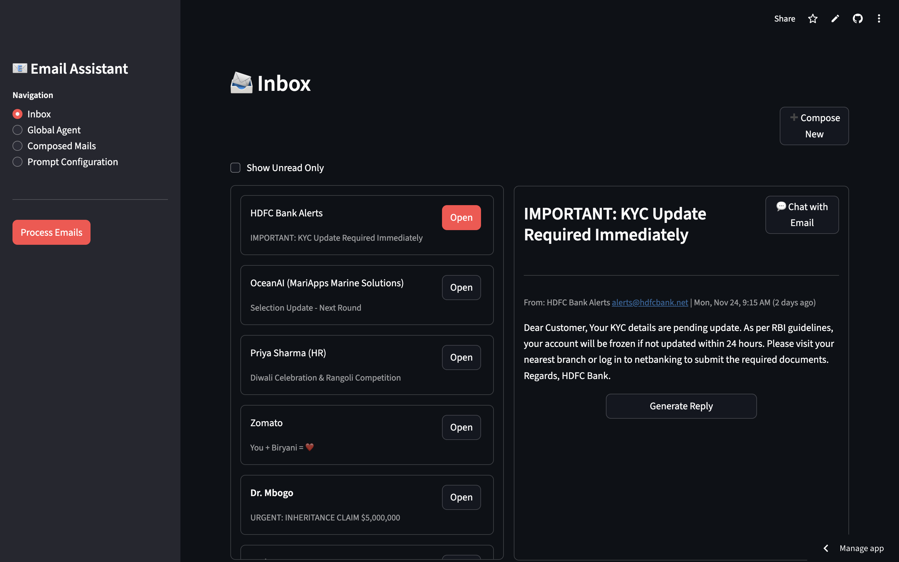

# Email Assistant

A smart, prompt-driven productivity tool designed to help you master your inbox. Built with Streamlit and powered by Groq's LLMs, this assistant automates the tedious parts of email management—categorization, action extraction, and drafting—so you can focus on what matters.

<!-- Application Demo Video -->



## Key Features

### 📧 Intelligent Inbox
Your emails are automatically tagged (e.g., "Important", "To-Do") and organized for easy navigation.

### ✅ Action Extraction
Never miss a deadline. The assistant scans your emails and highlights actionable tasks and due dates.

### 🔍 Smart Filtering
Easily toggle the "Show Unread Only" filter to focus on what needs your immediate attention.

### 💬 Context-Aware Chat
- **Email Chat**: Ask questions about specific emails or request summaries.
- **Global Agent**: Query your entire inbox (e.g., "What are my top priorities today?"). It remembers your recent conversation context.

### ✍️ AI-Powered Drafting
- **Auto-Reply**: Generate professional replies with a single click.
- **Compose from Scratch**: Provide a simple instruction (e.g., "Ask John for the Q3 report"), and let the AI draft a polished email for you.

### 📝 Draft Management
**Composed Mails**: Dedicated storage for your newly composed email drafts, keeping them separate from reply drafts.

### 🧠 Customizable "Brain"
Tailor the agent's behavior by editing the system prompts for categorization, extraction, and tone directly from the configuration page.

---

## Setup Instructions

### 1. Clone the Repository
```bash
git clone <repository-url>
cd Email_assistent
```

### 2. Install Dependencies

We recommend using a virtual environment.
```bash
pip install -r requirements.txt
```

Ensure you have `streamlit`, `langchain-groq`, `python-dotenv`, and other requirements installed.

### 3. Environment Configuration

Create a `.env` file in the root directory and add your Groq API key:
```env
GROQ_API_KEY=your_groq_api_key_here
```

### 4. Data Setup

The application uses JSON files for local storage (simulating a database):

- `data/mock_inbox.json`: Sample email data
- `data/prompts.json`: User-defined system prompts
- `data/new_compose.json`: Storage for your drafted emails

---

## How to Run

Launch the application using Streamlit:
```bash
streamlit run app.py
```

The app will open automatically in your default browser at `http://localhost:8501`.

---

## Usage Guide

### 📨 Inbox

- **Browse & Filter**: Scroll through your emails or use the "Show Unread Only" checkbox to declutter your view.
- **Deep Dive**: Click "Open" on any email to view its full content, extracted action items, and to start a chat session specific to that email.
- **Compose New**: Click the "➕ Compose New" button to draft a fresh email. Give the AI an instruction, and it will generate the body text for you. You can then save this to your "Composed Mails" drafts.

### 📂 Composed Mails

- **View Drafts**: Access all your saved drafts for newly composed emails here.
- **Separate Storage**: This section is specifically for new emails you have initiated (from the "Compose New" button). It does not contain drafts of replies to incoming emails, keeping your proactive communications distinct from your reactive ones.

### 🌐 Global Agent

- Switch to the "Global Agent" tab to ask high-level questions about your inbox.
- **Example queries**:
  - "Do I have any urgent emails from HR?"
  - "Summarize the newsletters I received today."
- The agent remembers the last few messages, so you can ask follow-up questions naturally.

### ⚙️ Configuration

Visit the "Prompt Configuration" section to tweak how the AI behaves. You can adjust the instructions for how it categorizes emails, extracts tasks, or adopts a specific tone for replies.

---

## Project Structure
```
Email_assistent/
├── app.py                      # Main application entry point
├── services/
│   ├── llm_services.py        # Core logic for Groq LLM interaction
│   ├── utils.py               # Helper functions for parsing and formatting
│   └── data_manager.py        # JSON data file read/write operations
├── data/
│   ├── mock_inbox.json        # Sample email data
│   ├── prompts.json           # User-defined system prompts
│   └── new_compose.json       # Drafted email storage
├── assets/
│   └── UI.mp4                 # Demo video
├── requirements.txt           # Python dependencies
└── .env                       # Environment variables (API keys)
```

---

## Technologies Used

- **[Streamlit](https://streamlit.io/)**: Fast web app framework for Python
- **[Groq](https://groq.com/)**: High-performance LLM inference
- **[LangChain](https://www.langchain.com/)**: LLM application framework
- **Python 3.x**: Core programming language


## Support

For issues, questions, or feature requests, please open an issue in the repository.
